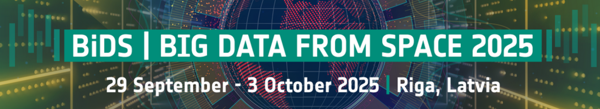
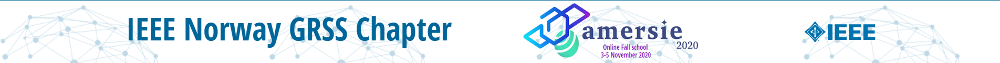
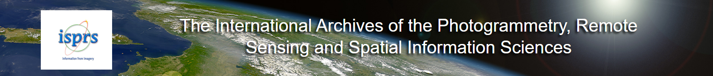

---

title: Conferences 🤖 💡 </> 🏁
subtitle: Hands-on Learning Through **Innovation and Collaboration**
summary: A showcase of workshops and hackathons that amplified my expertise in LiDAR, machine learning, geospatial intelligence, and entrepreneurship—focusing on real-world data challenges and interdisciplinary teamwork in forestry and environmental domains.
tags:
- Hackathon
- Machine Learning
- Artificial Intelligence
- Generative AI
- RAG
- Spatial AI
- Geosciences
- LiDAR
- Point Cloud
- Finnish Forests
- Machine Learning
- Geospatial Analytics
- Biodiversity Monitoring
- Remote Sensing
- NLS
- Forest Data
- Spatial AI
- Environmental Data Science
- Entrepreneurship
- Team Collaboration
- Forestry Innovation
date: "2025-10-03"
external_link: ""

image:
  caption: ''
  focal_point: Smart

---

# Big Data from Space 2025
## BiDS 2025

**Date**:  29 Sept - 03 October, 2025 
**Location**: [University of Latvia, Rīga](https://maps.app.goo.gl/eJdiSMnJUH4eu96b8), [National Library of Latvia, Rīga](https://maps.app.goo.gl/mnwyzSNEhsXwifBr8) 
**Website**: [Offcial Website of Event](https://isprs-archives.copernicus.org/articles/XLII-5/) 
**Sponsers**: *European Commission's Joint Research Centre* || *SATCEN - European Union Satellite Centre* || *ESA - European Space Agency* || *European Union* || *2027 National Development Plan* || *Ministry of Education and Science Republic of Latvia* || *research Latvia* || *Investment and Development Agency of Latvia* || *MISSION Latvia* || *LAIK - Latvian Space Industry Association* || *UNIVERSITY OF LATVIA* || *AIRBUS* || *CDSE* || *European Commission* || *EO59* || *EUMETSAT* || *Institute for Environmental Solutions, Latvia* || *ESA BIC Latvia* || *Eurogeospatial Reactor* || *ESRI* || *neuralio Artificial Intelligence* || *QBSS - Baltic Satellite Service* || *TERRADUE* || *VIRAC* || *VIRATEC* || *UNIVERSITY OF TARTU Landscape Geoinformatics Lab* 
 

> Key Highlights:
> * 🏆 Award-Winning AI Innovation: Secured a top prize at the ThinkingEarth Hackathon (held at BiDS 2025) for rapidly developing an advanced solution using AI and geospatial data  
Hackathon: [Harnessing Copernicus Foundation Models to Decode Earth from Space: Vision-Language Models for EO - connect imagery and text to enhance EO data interpretation](https://thinkingearth-hackathon.devpost.com/?_gl=1*mgzswr*_ga*MTE2NTI5MjY0OS4xNzU5MTQ2MTUy)  
Hackathon 2nd Prize: [Disaster-GeoRAG, AI that knows when to say ‘uncertain’: improving disaster detection for emergency responders](https://devpost.com/software/disaster-georag)
> * 🛰️ Copernicus-Scale Intelligence: Engaged with leading-edge research focused on leveraging massive Earth Observation (EO) datasets and Copernicus-scale foundation models for global insights
> * 🧠 Next-Gen Geospatial Models: Applied state-of-the-art EO Foundation Models, AI Weather Forecasting Models, and Vision-Language Models to interpret and predict complex Earth system changes
> * 🌎 High-Impact EO Solutions: Focused development efforts on critical real-world applications such as water surface mapping, disaster-response systems, and deforestation pattern detection
> * 🤝 Interdisciplinary Co-Creation: Participated in a dynamic environment that fostered rapid development and collaboration among AI experts, data scientists, and climate researchers
 

---

# AGU Fall Meeting 2020
## AGU20

**Date**: 1 - 17 December 2020 (Main Scientific Program: 7 - 11 December) 
**Location**: **Virtual Event** 
**Website**: [AGU Fall Meeting 2020 Official Website](https://www.agu.org/fall-meeting-2020) 
**Theme**: Shaping the Future of Science 
**Sponsers**: *American Geophysical Union (AGU)* || *The Planetary Society* || *ESA (European Space Agency)* || *NOAA (National Oceanic and Atmospheric Administration)* || *NASA* || *U.S. Department of Energy* || *National Science Foundation (NSF)* || *USGS (U.S. Geological Survey)* || *AGI (American Geosciences Institute)* || *The World Bank* || *Earth and Space Science News (Eos)* || *Numerous other university, government, and industry exhibitors* || *LEIDOS* || *Lockheed Martin* || *CUAHSI* || *WILEY* || *BALL* || *Raytheon Intelligene & Space*
 

> Key Highlights:
> * 🎓 **Leading Global Science:** Attended the world's largest virtual gathering of Earth and space scientists, engaging with over 1,800 sessions and nearly 20,000 presentations.
> * 📝 **Peer-Reviewed Presentation:** Presented a co-authored paper titled **"Monitoring and modeling land subsidence due to hydrocarbon production integrating geodesy and geophysics"** (Abstract ID: T012-0007)  
Abstract: [Monitoring and modeling land subsidence due to hydrocarbon production integrating geodesy and geophysics](https://agu.confex.com/agu/fm20/meetingapp.cgi/Paper/754443)
> * 🌍 **Integrated Geodetic-Geophysical Research:** Contributed to a session focused on applying **cutting-edge geodetic techniques** (e.g., InSAR, GNSS) and **geomechanical modeling** to monitor and predict **land subsidence** caused by subsurface fluid extraction.
> * 💻 **Virtual Engagement & Networking:** Successfully participated in the first fully **virtual** AGU Fall Meeting, leveraging the online platform for on-demand content, live Q\&A sessions, and global networking.
> * 📈 **Applied Geohazards Analysis:** Showcased research aimed at providing more accurate and efficient monitoring of **anthropogenic geohazards**, supporting effective management and mitigation strategies in resource extraction regions.
 

---

# Advanced Methods for Remote Sensing Information Extraction Fall School
## AMERSIE 2020

**Date**: November 2020 
**Location**: **Online / Virtual Event** 
**Website**: [IEEE Norway GRSS Chapter - AMERSIE](https://r8.ieee.org/norway-grss/amersie/) 
**Sponsers**: *IEEE Geoscience and Remote Sensing Society (GRSS) Norway Chapter* || *IEEE GRSS Spain Chapter* || *IEEE ChapNet initiative*
 

> Key Highlights:
> * 🎓 **Advanced Signal Processing:** Focused on introducing advanced signal processing methods for information retrieval.
> * 🛰️ **Large-Scale Remote Sensing Data:** Applied methods to process and extract information from **large-scale datasets** collected by multiple remote sensors.
> * 🇪🇸 **International Collaboration:** Jointly organized by the **IEEE GRSS Chapters of Norway and Spain** under the IEEE ChapNet initiative.
> * 💻 **Virtual School:** Successfully attended all important sessions of the fully **online** fall school, as confirmed by the participant.
> * 📚 **Information Extraction:** Core theme centered around **Information Extraction** techniques from complex Earth Observation (EO) data.
 

---

# ISPRS TC V Mid-Term Symposium "Geospatial Technology – Pixel to People" 2018
## ISPRS

**Date**:  20-23 November, 2018 
**Location**: [Indian Institute of Remote Sensing, 4 Kalidas Road, Dehradun](https://maps.app.goo.gl/Ukcxrb91yTujwfM69) 
**Website**: [Offcial Website of Event](https://isprs-archives.copernicus.org/articles/XLII-5/) 
**Sponsers**: *IIRS* || *ISRO* || *Antrix Corp. Ltd.* || *NESAC* || *ESRI India* || *Hexagon Geospatial* || *DELL India* || *ISPRS Foundation (TIF)* 
 

> Key Highlights:
> * 📝 **Published Research Contribution**: Successfully presented and published a peer-reviewed research article in the ISPRS Archives proceedings, contributing new scientific knowledge to the symposium's themes  
Article: [PSInSAR Study of Lyngenfjord Norway, using TerraSAR-X Data](https://isprs-annals.copernicus.org/articles/IV-5/245/2018/isprs-annals-IV-5-245-2018.html)
> * 🎓 **Global Geospatial Education**: Fostered a worldwide platform focused on advancing multi-level education, training, and capacity building in remote sensing and photogrammetry
> * 🛰️ **Pixel-to-People Applications**: Highlighted innovative methodologies for translating satellite and sensor data into practical solutions for societal benefits and sustainable development
> * 📊 **Big Geospatial Data Analytics**: Explored pioneering tools and educational strategies for handling, analyzing, and deriving intelligence from large, heterogeneous geospatial data streams
> * 🌐 **International Collaboration & Outreach**: Emphasized cross-border cooperation and the development of cost-effective distance learning programs for a global audience of educators and professionals