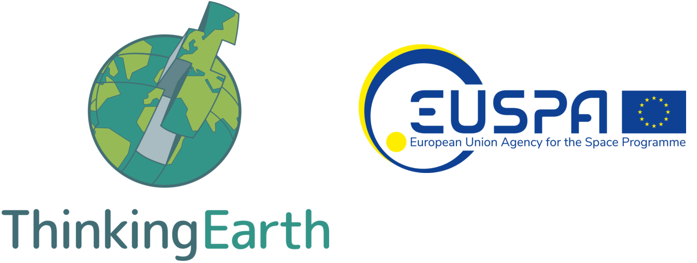
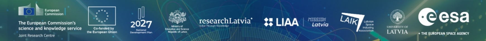
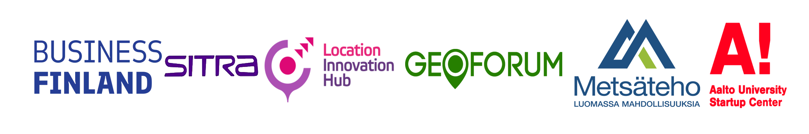

---

title: Hackathons 💻 👨🏻‍💻 💡 </> 🏁 🚀
subtitle: Hands-on Learning Through **Innovation and Collaboration**
summary: A showcase of hackathons that amplified my expertise in Artificial Intelligence, machine learning, geospatial intelligence, LiDAR, and entrepreneurship—focusing on real-world data challenges and interdisciplinary teamwork in forestry and environmental domains.
tags:
- Hackathon
- Innovation
- Competitive Programming
- Rapid Prototyping
- Team Collaboration
- Cross-functional Teams
- LiDAR
- Point Cloud
- 3D Reconstruction
- Finnish Forests
- Forest Monitoring
- Forest Data
- Biodiversity Monitoring
- Environmental Data Science
- Artificial Intelligence
- AI
- Generative AI
- Large Language Models (LLMs)
- Machine Learning
- Deep Learning
- Computer Vision
- Geospatial Analytics
- Spatial AI
- Remote Sensing
- Earth Observation
- Environmental Monitoring
- NLS
- Finnish National Land Survey
- Problem Solving
- Creative Problem Solving
- Design Thinking
- Innovation Labs
- Startup Experience
- Entrepreneurship
- Product Development
- User Experience Design
- Technical Writing
- Presentation Skills
- Public Speaking
- Networking
- Community Building
- Entrepreneurship
- Team Collaboration
- Forestry Innovation
date: "2025-10-03"
external_link: ""

image:
  caption: ''
  focal_point: Smart

---

# Thinking Earth Hackathon - Harnessing Copernicus Foundation Models to Decode Earth from Space
## Vision-Language Models for EO: connect imagery and text to enhance EO data interpretation
### Thinking Earth & EU Agency for the Space Program

**Date**: 29-30 Sept, 2025 
**Hosted at**: [BiDS 2025 (Big Data from Space)](https://www.bigdatafromspace2025.org/), [University of Latvia, Rīga, LV-1004](https://maps.app.goo.gl/eJdiSMnJUH4eu96b8) Latvia 🇱🇻 
**Track Followed**: EO Vision-Language Models (Track 3) 
**Organizer**: ThinkingEarth (Horizon Europe Project) 
**Website**: [Devpost – ThinkingEarth Hackathon](https://thinkingearth-hackathon.devpost.com/) 
**Sponsers**: *Thinking Earth* || *EUSPA* || *ESA* || *EUMETSAT* || *JRC, European Commision* || *Institute for Environmental Solutions, Latvia* || *National Technical Universty of Athens* || *National Observatory of Athens* || *TU Munich* || *NVIDIA* || *Evenflow* 
**Collaborator**: [Athanasios Trantas](https://www.linkedin.com/in/trantas/) & [Udit Asopa](https://www.linkedin.com/in/uditasopa/)  
 

Key Highlights:

> * 🛰️ EO Vision-Language Models Exploration: Built and fine-tuned multimodal deep learning workflows combining satellite imagery and text for Earth observation understanding
> * 💬 Natural Language Interaction with EO Data: Experimented with vision-language models (VLMs) for image captioning, visual question answering, and geospatial data retrieval
> * 🤖 AI for Earth Interpretation: Leveraged Copernicus datasets and foundation models to enhance explainability and accessibility of Earth observation data
> * 🧠 Interdisciplinary Collaboration: Worked alongside participants from AI, remote sensing, and atmospheric sciences to bridge language and visual modalities
> * 🌐 Innovation in EO Accessibility: Contributed toward future-facing research on using VLMs to make geospatial analytics more intuitive and interactive for scientists and policymakers

# Beyond Dead Wood Hackathon - Data and AI in search of forest biodiversity
## Ultrahack

**Date**: 9 March, 2024 
**Location**: [Maria01, Lapinlahdenkatu 16, Helsinki](https://maps.app.goo.gl/CTzELxoYeUQnvTpS9) 
**Website**: [Offcial Website of Event](https://new.ultrahack.org/hackathons/beyond-dead-wood-hackathon) 
**Sponsers**: *Business Finland* || *SITRA* || *Location Innovation Hub* || *GEOFORUM* || *Metsäteho Oy* || *Aalto University Startup Center* || *Vaisala* || *NLS* || *Arbonaut* 
**Collaborator**: [Udit Asopa](https://www.linkedin.com/in/uditasopa/), [Monika Sharma](https://www.linkedin.com/in/monikasharma0701/), [Gabriel Chibuye](https://www.linkedin.com/in/gabriel-chibuye/) & [Vesa Haaparanta](https://www.linkedin.com/in/vesahaaparanta/) 

Key Highlights:
> * 🌲 Finnish Forest Innovation: Tackled real-world forestry challenges using data science and geospatial insights
> * 🌐 NLS Point Cloud Utilization: Leveraged high-resolution open LiDAR data to analyze forest structure and deadwood distribution
> * 🤖 ML-Powered Forestry Solutions: Teams applied machine learning techniques to classify forest elements and detect biodiversity indicators
> * 💡 Entrepreneurial Focus: Encouraged actionable ideas with commercial potential to benefit forest health and sustainability
> * 👥 Collaborative Hackathon Environment: Brought together interdisciplinary teams combining programming, environmental science, and business
