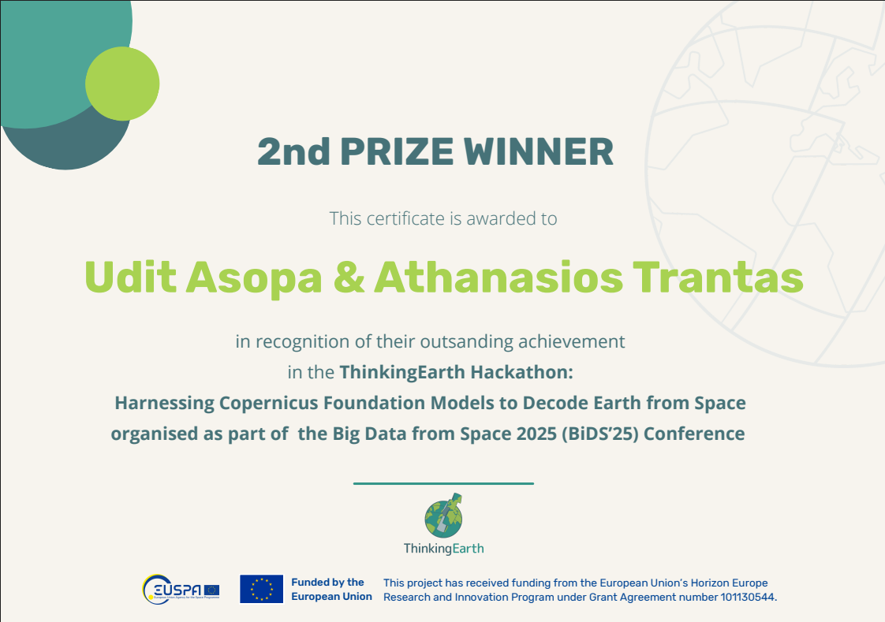

## 🔥 Recent LinkedIn Highlights

### Latest Professional Updates

<!-- Modal CSS and JavaScript -->

<!-- Grid of LinkedIn posts - 2 columns, 3 rows -->

<iframe src="https://www.linkedin.com/embed/feed/update/urn:li:activity:7380922567794171904/" height="400" width="100%" frameborder="0" allowfullscreen="True" title="LinkedIn Post 1"></iframe>

🔍 Click to enlarge

<iframe src="https://www.linkedin.com/embed/feed/update/urn:li:activity:7384189980446765056/" height="400" width="100%" frameborder="0" allowfullscreen="True" title="LinkedIn Post 2"></iframe>

🔍 Click to enlarge

<iframe src="https://www.linkedin.com/embed/feed/update/urn:li:activity:7384146328894873600/" height="400" width="100%" frameborder="0" allowfullscreen="True" title="LinkedIn Post 3"></iframe>

🔍 Click to enlarge

<iframe src="https://www.linkedin.com/embed/feed/update/urn:li:activity:7378910080601239552/" height="400" width="100%" frameborder="0" allowfullscreen="True" title="LinkedIn Post 4"></iframe>

🔍 Click to enlarge

<iframe src="https://www.linkedin.com/embed/feed/update/urn:li:activity:7384865808419598337/" height="400" width="100%" frameborder="0" allowfullscreen="True" title="LinkedIn Post 5"></iframe>

🔍 Click to enlarge

<iframe src="https://www.linkedin.com/embed/feed/update/urn:li:activity:7382442829794680832/" height="400" width="100%" frameborder="0" allowfullscreen="True" title="LinkedIn Post 6"></iframe>

🔍 Click to enlarge

<iframe src="https://www.linkedin.com/embed/feed/update/urn:li:activity:7379818009638477824/" height="400" width="100%" frameborder="0" allowfullscreen="True" title="LinkedIn Post 7"></iframe>

🔍 Click to enlarge

<iframe src="https://www.linkedin.com/embed/feed/update/urn:li:activity:7382327551802712064/" height="400" width="100%" frameborder="0" allowfullscreen="True" title="LinkedIn Post 8"></iframe>

🔍 Click to enlarge

<iframe src="https://www.linkedin.com/embed/feed/update/urn:li:activity:7384437942175404032/" height="400" width="100%" frameborder="0" allowfullscreen="True" title="LinkedIn Post 9"></iframe>

🔍 Click to enlarge

<iframe src="https://www.linkedin.com/embed/feed/update/urn:li:activity:7377638297080254465/" height="400" width="100%" frameborder="0" allowfullscreen="True" title="LinkedIn Post 10"></iframe>

🔍 Click to enlarge

<iframe src="https://www.linkedin.com/embed/feed/update/urn:li:activity:7377313041622745088/" height="400" width="100%" frameborder="0" allowfullscreen="True" title="LinkedIn Post 11"></iframe>

🔍 Click to enlarge

<iframe src="https://www.linkedin.com/embed/feed/update/urn:li:activity:7350258874710474753/" height="400" width="100%" frameborder="0" allowfullscreen="True" title="LinkedIn Post 12"></iframe>

🔍 Click to enlarge

<!-- Modal Windows for each post -->

  

    &times;
    <iframe src="https://www.linkedin.com/embed/feed/update/urn:li:activity:7380922567794171904/" title="LinkedIn Post 1 - Enlarged"></iframe>
  

  

    &times;
    <iframe src="https://www.linkedin.com/embed/feed/update/urn:li:activity:7384189980446765056/" title="LinkedIn Post 2 - Enlarged"></iframe>
  

  

    &times;
    <iframe src="https://www.linkedin.com/embed/feed/update/urn:li:activity:7384146328894873600/" title="LinkedIn Post 3 - Enlarged"></iframe>
  

  

    &times;
    <iframe src="https://www.linkedin.com/embed/feed/update/urn:li:activity:7378910080601239552/" title="LinkedIn Post 4 - Enlarged"></iframe>
  

  

    &times;
    <iframe src="https://www.linkedin.com/embed/feed/update/urn:li:activity:7384865808419598337/" title="LinkedIn Post 5 - Enlarged"></iframe>
  

  

    &times;
    <iframe src="https://www.linkedin.com/embed/feed/update/urn:li:activity:7382442829794680832/" title="LinkedIn Post 6 - Enlarged"></iframe>
  

  

    &times;
    <iframe src="https://www.linkedin.com/embed/feed/update/urn:li:activity:7379818009638477824/" title="LinkedIn Post 7 - Enlarged"></iframe>
  

  

    &times;
    <iframe src="https://www.linkedin.com/embed/feed/update/urn:li:activity:7382327551802712064/" title="LinkedIn Post 8 - Enlarged"></iframe>
  

  

    &times;
    <iframe src="https://www.linkedin.com/embed/feed/update/urn:li:activity:7384437942175404032/" title="LinkedIn Post 9 - Enlarged"></iframe>
  

  

    &times;
    <iframe src="https://www.linkedin.com/embed/feed/update/urn:li:activity:7377638297080254465/" title="LinkedIn Post 10 - Enlarged"></iframe>
  

  

    &times;
    <iframe src="https://www.linkedin.com/embed/feed/update/urn:li:activity:7377313041622745088/" title="LinkedIn Post 11 - Enlarged"></iframe>
  

  

    &times;
    <iframe src="https://www.linkedin.com/embed/feed/update/urn:li:activity:7350258874710474753/" title="LinkedIn Post 12 - Enlarged"></iframe>
  

---

### Featured Posts & Announcements

<!-- Real LinkedIn post summaries with links -->

#### 🏆 **Hackathon Victory: 2nd Place at ThinkingEarth BiDS25**

*Link*: [View on LinkedIn](https://www.linkedin.com/feed/update/urn:li:activity:7380922567794171904/), [Github Repo "Disaster-GeoRAG"](https://github.com/DjAzDeck/Disaster-GeoRAG), [Hackathon Webpage](https://thinkingearth-hackathon.devpost.com/), [Conference Page](https://www.bigdatafromspace2025.org/) 

> **Major Achievement**: Won 2nd Place at the ThinkingEarth hackathon during Big Data from Space (BiDS25) conference in Riga, Latvia! Built "Disaster-GeoRAG" - a cutting-edge Retrieval-Augmented Generation system combining Qwen Vision-Language Model with FAISS embeddings for satellite imagery disaster detection.
> 
> **Key Innovation**: Created an explainable AI system that grounds answers in authoritative knowledge from Copernicus EMS and NASA Earthdata, producing structured outputs with disaster type, confidence levels, and transparent rationale. The system reduces false positives and improves trust in AI for Earth observation applications.
> 
> **Collaboration**: Partnered with brilliant colleague Thanasis Trantas and showcased skills alongside experts from NVIDIA, Technical University of Munich, National Observatory of Athens, and other leading organizations. Built a working prototype with Gradio app in under 8 hours!

<a href="hackathon_certificate.png" target="_blank" style="text-decoration: none; color: #007bff;">
📄 View Full Certificate
</a>

---

#### 💻 **GitHub Portfolio & Open Source Projects**

*Links*:   
[Vision Text Extractor](https://github.com/udit-asopa/vision-text-extractor)  
[Disaster-GeoRAG Project](https://github.com/DjAzDeck/Disaster-GeoRAG)  
[GitHub Profile - All Repositories](https://github.com/udit-asopa?tab=repositories)

> **Featured Project**: **Vision Text Extractor** - A comprehensive OCR and document processing tool that extracts text from images using multiple AI providers. Supports both privacy-first local models (SmolVLM, LLaVA) and cloud-based solutions (OpenAI GPT-4o). Features include custom prompts, web URL processing, and extensive documentation. Built with Python and Pixi for easy installation and cross-platform compatibility.
> 
> **Technical Focus**: Specializing in computer vision, document AI, geospatial analytics, and machine learning applications. Active contributor to projects involving satellite imagery analysis, disaster detection systems, and educational resources for the tech community.

---

#### 🎓 **IBM Generative AI Certification Series**

*Links*:   
[IBM - Build RAG Applications](https://coursera.org/share/f7e784da17430f850863a97257d396e8)   
[IBM - Develop Generative AI Applications](https://coursera.org/verify/AXC7ZM71GKOG)

> **Professional Development**: Successfully completed IBM's comprehensive Generative AI course series, mastering advanced prompt engineering, LangChain framework, and Flask application development. Gained expertise in building RAG applications, model evaluation, and creating context-aware AI solutions for real-world applications.

---

#### 🚀 **Career Growth & Remote Sensing Innovation**

*Links*:   
[From Efficient Foundation Models to AI Agents for Foundation Model Recommendation to Advance Earth Observation](https://www.grss-ieee.org/event/from-efficient-foundation-models-to-ai-agents-for-foundation-model-recommendation-to-advance-earth-observation/)   
[Deep Learning for SAR Image Analysis](https://www.grss-ieee.org/event/deep-learning-for-sar-image-analysis/)   
[Toward Trustworthy AI: Principled and Automated Interpretability in Neural Networks](https://www.grss-ieee.org/event/toward-trustworthy-ai-principled-and-automated-interpretability-in-neural-networks/)

> **Career Update**: Continuing professional journey at ICEYE Oy in Finland, focusing on advanced SAR (Synthetic Aperture Radar) data analysis and machine learning applications in Earth observation. Contributing to cutting-edge research in geospatial analytics and remote sensing technologies for real-time monitoring and analysis.

---

## 📝 Blog-Style Updates

### October 2025 Updates

- 🎯 **New Certifications**: Recently completed IBM Generative AI courses - [View Details](../../../courses/online_courses/)
- 🔬 **Research Focus**: Expanding work in geospatial ML applications
- 🌟 **Professional Growth**: Continuing journey at ICEYE Oy, Finland

### Coming Up

- 👨‍💻 Attending another hackathon [10th CASSINI Hackathon: EU Space for Consumer Experience!](https://www.cassini.eu/hackathons/finland)
- 📚 Exploring advanced LLM applications in remote sensing
- 🤝 Looking forward to new collaboration opportunities
- 🎨 Continuous website improvements and content updates

---

## 🔗 Connect & Follow

Stay connected for more updates:

- **LinkedIn**: [My LinkedIn Profile -- uditasopa](https://linkedin.com/in/uditasopa)
- **GitHub**: [My GitHub -- udit-asopa](https://github.com/udit-asopa)
- **Email**: [udit.asopa@gmail.com](mailto:udit.asopa@gmail.com)

---

*Last updated: October 2025*